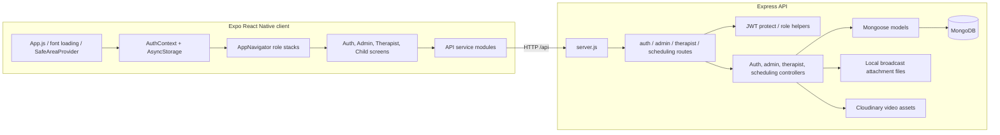

# Healers app architecture and code review

Scope: static review of the checked-in React Native client (`Healers/`) and Express/Mongoose API (`Backend/`). No source files were changed and no tests or runtime checks were run. Findings below are based on the code as checked in and should be confirmed against the intended deployment configuration.

## Architecture

### Client organization

- `Healers/App.js` loads Poppins fonts, installs the safe-area provider and `AuthProvider`.
- `src/context/AuthContext.js` restores a saved session and exposes `login`, `logout`, `token`, and `userRole`.
- `src/navigation/AppNavigator.js` selects separate Auth, Admin, Therapist, and Child native stacks based on role.
- Screens are grouped by auth/admin/therapist/child features under `src/screens/`; shared navigation bars and top bar are in `src/components/`.
- `src/api/apiClient.js` provides the Axios base client; feature modules under `src/api/` wrap endpoints. Utilities and theme live under `src/utils/` and `src/styles/`.

### Backend organization

- `Backend/server.js` configures Express, JSON/form parsing, request logging, MongoDB connection, static broadcast files, API mounts and error handling.
- `Backend/routes/` mounts auth, admin, therapist, and scheduling endpoints.
- `Backend/middleware/authMiddleware.js` verifies JWTs and defines role/permission guards.
- Controllers implement the use cases; `Backend/models/` holds Mongoose schemas for users, schedules, programs, feedback, leave, invoices/fees, batches, notifications/broadcasts, and videos.
- Broadcast attachments are persisted under `Backend/assets/broadcasts/` using Multer; weekly videos are uploaded from the client directly to Cloudinary and their metadata is saved via the API.

### Main data flows

1. Login/register calls `authService.js` → `/api/auth/*`; AuthContext stores session state and AppNavigator switches stacks.
2. Admin and therapist screens call their feature API modules → role-specific route groups → controllers → MongoDB.
3. Scheduling data is stored as month/year documents containing embedded appointments. Feedback, attendance, and dashboards join against these embedded appointments.
4. Broadcasts store audience/recipient/read state in `Notification`; uploaded attachment bytes are local files served from `/assets/broadcasts`.
5. Weekly video bytes go from the client to Cloudinary; the API stores URLs and Cloudinary identifiers in the `Video` model.

## Findings

### Critical: unauthenticated account creation can create privileged users

`POST /api/auth/register` is public, and `authController.register` accepts `role`, `permissions`, and `biometricKey` directly from the request body. A caller can request an `Admin` account and receive a signed token. See [authRoutes.js](/C:/Users/LHCL/healers/Backend/routes/authRoutes.js:12) and [authController.js](/C:/Users/LHCL/healers/Backend/controllers/authController.js:13). This defeats the rest of the authorization boundary.

### Critical: authenticated routes do not consistently enforce roles, and many sensitive routes have no auth at all

The route groups use `protect` alone for many admin and therapist operations; `protect` validates a token but does not check its role, and the imported `checkRole` is not applied to these endpoints. Separately, all scheduling endpoints are public, and admin overview/therapist/user listings, feedback listing/deletion, broadcast detail/update, and other routes are mounted without `protect`. This allows anonymous or wrong-role callers to read or mutate sensitive data. See [adminRoutes.js](/C:/Users/LHCL/healers/Backend/routes/adminRoutes.js:8), [schedulingRoutes.js](/C:/Users/LHCL/healers/Backend/routes/schedulingRoutes.js:14), and [authMiddleware.js](/C:/Users/LHCL/healers/Backend/middleware/authMiddleware.js:20).

### High: feedback creation can fail validation for valid-looking client states

The feedback schema allows `Happy`, `Neutral`, `Sad`, `Anxious`, `Calm`, and `Frustrated`; the Add Feedback screen also offers `Excited`. Saving that option fails schema validation. In addition, the server's missing-mood fallback is lowercase `happy`, which is also outside the enum. The controller catches these errors and returns 500. See [Feedback.js](/C:/Users/LHCL/healers/Backend/models/Feedback.js:51), [AddFeedback.jsx](/C:/Users/LHCL/healers/Healers/src/screens/therapist/AddFeedback.jsx:29), and [therapistController.js](/C:/Users/LHCL/healers/Backend/controllers/therapistController.js:726).

### High: session credentials have competing storage keys

AuthContext persistence uses `jwt_token` and `user_info`, while the API interceptor reads `userToken`; auth service methods also write `userToken` and `userData`. The 401 handler removes only the latter pair. This creates split session state: logout can leave the API token behind, and expired-token cleanup does not clear AuthContext's persisted session. See [storage.js](/C:/Users/LHCL/healers/Healers/src/utils/storage.js:3), [apiClient.js](/C:/Users/LHCL/healers/Healers/src/api/apiClient.js:19), and [authService.js](/C:/Users/LHCL/healers/Healers/src/api/authService.js:12).

### High: app has a fixed private-network API address

The client uses `http://192.168.88.76:5000/api` in both the API client and media utility. This will fail outside that LAN and uses cleartext HTTP, so production builds can either be unreachable or expose credentials/session tokens on an untrusted network. Use an environment/build profile URL and HTTPS for deployed environments. See [apiClient.js](/C:/Users/LHCL/healers/Healers/src/api/apiClient.js:5) and [media.js](/C:/Users/LHCL/healers/Healers/src/utils/media.js:1).

### Medium: therapist operations trust client supplied identity/child IDs

Several therapist handlers accept a therapist ID from query/body parameters instead of always using the verified token, and no visible assignment check ensures that the authenticated therapist owns the requested child/program. For example, dashboard stats accept `req.query.filter`; program retrieval accepts `req.query.therapistId`; program creation accepts `therapistId` and `childId` from the body. After authentication is fixed, this still permits cross-therapist reads/writes unless identity and assignment are enforced in each handler. See [therapistController.js](/C:/Users/LHCL/healers/Backend/controllers/therapistController.js:14), [therapistController.js](/C:/Users/LHCL/healers/Backend/controllers/therapistController.js:155), and [therapistController.js](/C:/Users/LHCL/healers/Backend/controllers/therapistController.js:185).

### Medium: `checkPermission` can throw when a token omits permissions

The helper calls `req.user.permissions.includes(...)` without guarding for an absent permissions array. Current token creation includes the field from the user record, but older/manually issued tokens or malformed user state can turn an intended 403 into an uncaught TypeError. See [authMiddleware.js](/C:/Users/LHCL/healers/Backend/middleware/authMiddleware.js:29).

### Medium: invalid default argument in an API helper

`GetUsers` has `payload = { filter }`, but `filter` is not defined in this module. Calling `GetUsers()` with no argument raises `ReferenceError` before the request is sent. The helper is not currently referenced elsewhere under `src`, so this appears latent unless consumed by code outside the checked-in source. See [authApi.js](/C:/Users/LHCL/healers/Healers/src/api/authApi.js:3).

### Medium: auth navigation has no supported Parent stack

The User schema and registration accept `Parent`, but AppNavigator only maps Admin, Therapist, and Child. A Parent can authenticate successfully and then is sent to AuthStack while the token remains set, leaving an authenticated user without an app destination. Either add the intended Parent flow or reject/redirect this role deliberately. See [User.js](/C:/Users/LHCL/healers/Backend/models/User.js:21) and [AppNavigator.js](/C:/Users/LHCL/healers/Healers/src/navigation/AppNavigator.js:83).

### Medium: invoice and complaint screens are presentation-only mock data

Invoice Management filters a local `INVOICES` constant; Create New Invoice edits local state only. Complaint Management filters a hardcoded `ALL_COMPLAINTS` list. There are no matching invoice or complaint endpoints in the backend route groups, despite having a `Fee` model. These screens can look functional while changes/data never persist. See [InvoiceManagement.jsx](/C:/Users/LHCL/healers/Healers/src/screens/admin/InvoiceManagement.jsx:24), [CreateNewInvoice.jsx](/C:/Users/LHCL/healers/Healers/src/screens/admin/CreateNewInvoice.jsx:22), and [ComplainManagement.jsx](/C:/Users/LHCL/healers/Healers/src/screens/admin/ComplainManagement.jsx:24).

### Low: media URL generation duplicates the fixed host configuration

`media.js` repeats the client API host to create public asset URLs. Besides the deployment issue above, changing the API endpoint in one place can leave uploaded broadcast asset links pointing at a different server. Consolidate the origin setting.

## Suggested repair order

1. Lock registration to the intended public role; remove caller controlled permissions/biometric identity and add server-side validation.
2. Protect every non-public route and apply `checkRole`/ownership checks to admin, therapist, child, and schedule operations.
3. Unify session storage and make 401 handling clear both persisted and in-memory AuthContext state.
4. Align feedback UI and schema enums/defaults and return validation errors as client errors.
5. Configure environment-specific HTTPS API/asset origins.
6. Add the Parent route if Parent is a supported account role; remove unused broken `GetUsers` helper otherwise.

## Review limits

This is a static review of tracked source and configuration, not a complete dynamic assurance review. It does not verify runtime behavior, database contents, environment secrets, or live deployment routing. Build/test commands were not run.
